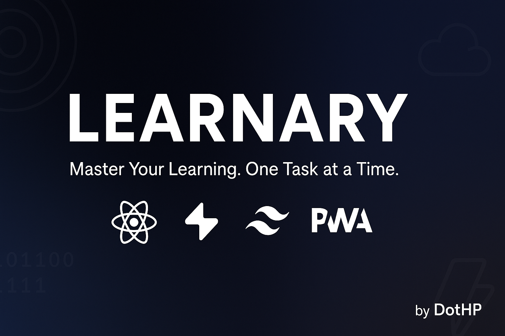
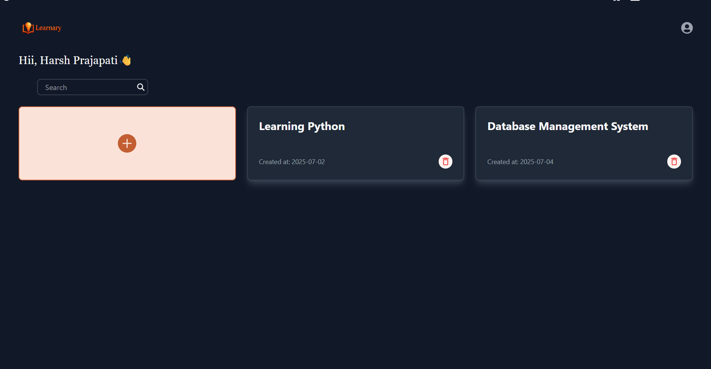
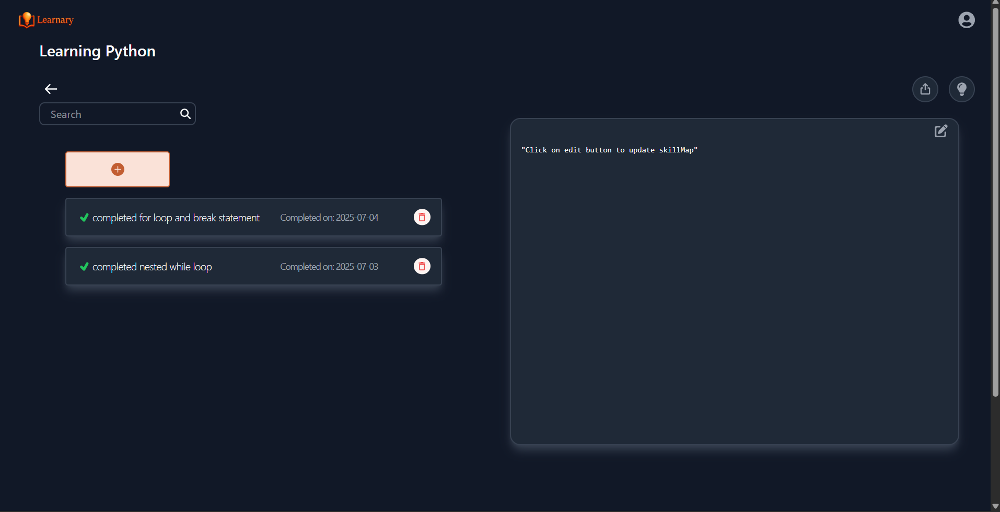
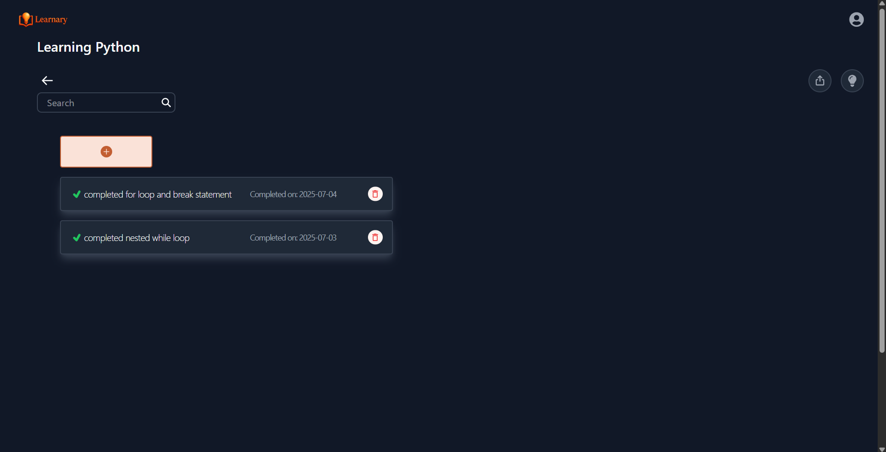
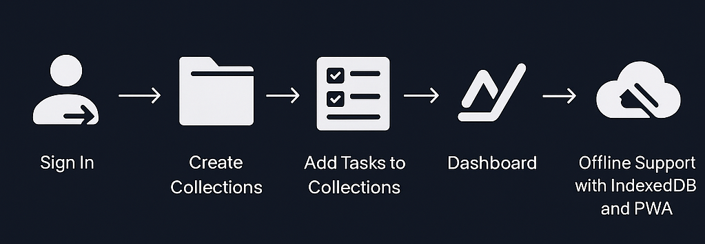

<h1  align="center" style=" display:flex; align-items: center; justify-content: center;"> Learnary — v1.0.0</h1>

Track your learning. One task at a time.

**Learnary** is your personal progressive web app (PWA) to **organize**, **track**, and **visualize** your learning journey. Group your goals into collections, write learning plans, complete tasks, and watch your knowledge grow.

---

## 🚀 Live Demo

click on the logo to visit the live demo

  

---

## ✨ Features (v1.0.0)

- ✅ **Topic-based Collections** — Group tasks under categories like React, Python, DSA, etc.
- ✅ **SkillMap** — Write your learning roadmap inside each collection.
- ✅ **Task Management** — Add, delete, and check off tasks with clean UI.
- ✅ **Progress Dashboard** — Weekly task stats, total tasks, and activity tracking.
- ✅ **Dark Mode** — Light and dark themes to suit your eyes.
- ✅ **Offline Support (PWA)** — Install it like an app and use offline.
- ✅ **Export Your Data** — Download tasks in JSON or CSV format.
- ✅ **Search Bar** — Quickly find any collection or task.
- ✅ **Protected Routes** — Secure access via Supabase authentication.

---

## 🖼️ Screenshots

### Collections

### SkillMap

### Tasks

### Dashboard

---

## 🔄 How Learnary Works

1. **Sign In** — User logs in with Supabase auth.
2. **Create Collections** — Group topics (e.g., "React", "SQL").
3. **Add Tasks** — Add learning tasks inside collections.
4. **Track Progress** — Dashboard shows charts, stats, active days.
5. **Go Offline or Install as App** — PWA lets you continue working without internet.

## 🔁 Learnary Workflow

---

## 🛠️ Tech Stack

| 🚀 Frontend | 🔐 Backend/Auth | 🎨 Styling   | ⚙️ Tools        |
| ----------- | --------------- | ------------ | --------------- |
| React 19    | Supabase Auth   | Tailwind CSS | Vite            |
| GSAP        | Supabase DB     | Dark Theme   | vite-plugin-pwa |

---

## 🚀 Future Enhancements

- [ ] 🧠 **AI-Powered Task Suggestions** — Use OpenAI or Groq API to analyze your skill map and auto-suggest learning tasks.

- [ ] 👥 **Collaborative Collections** — Allow users to share a collection with a teammate or mentor.

- [ ] 🔔 **Reminders & Notifications** — Add local notifications using the Web Notifications API or Push API.

- [ ] 📈 **Advanced Stats and Graphs** — Heatmap of task completions (like GitHub contribution graph).

- [ ] 📶 **Better Offline Experience** — Queue offline updates (new tasks/edits) and sync when online.

- [ ] 🧩 **Skill Progress Tracker** — Let users set milestones per skill.

- [ ] 🔐 **Two-Factor Authentication (2FA)** — Use Supabase 2FA or OTP via email for better security.

- [ ] 📝 **Custom Themes** — Allow users to choose from multiple themes.

---

## 👤 About Me

Hi! I’m **Harsh Prajapati**, the creator of Learnary — as my first major full-stack project.

I'm a self-taught frontend developer focused on building powerful, real-world apps.

I love exploring learning tech, coding productivity tools, and turning ideas into products.

---

## 📬 Contact

- 🔗 **Portfolio:** [Portfolio](https:dothp-harshu.github.io/portfolio)
- 💼 **LinkedIn:** [dothp](https://linkedin.com/in/dothp)
- 🐙 **GitHub:** [@dothp-harshu](https://github.com/dothp-harshu)

---

> Built with ❤️ by [DotHP](https://github.com/dothp-harshu)
